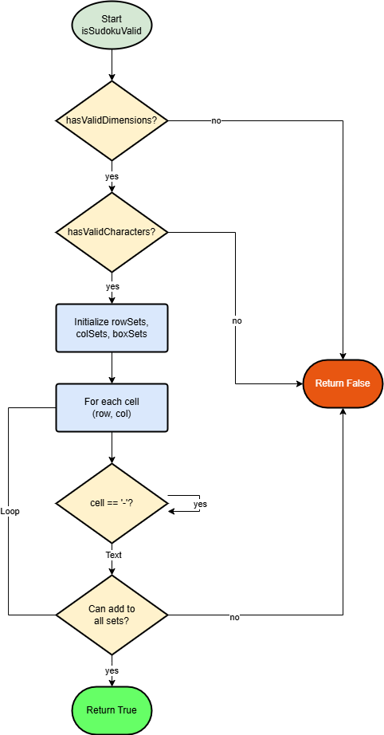

# Sudoku Validator
A Kotlin implementation of a Sudoku board validator with optimized O(n²) time complexity.

## Overview
This validator checks if a given Sudoku board is valid according to standard Sudoku rules. It performs three main validations:
1. Board dimensions
2. Character validity
3. Row, column, and box uniqueness

## Implementation

### Time Complexity
- Original: O(3n²) - separate passes for rows, columns, and boxes
- Optimized: O(n²) - single pass combining all checks

| Flowchart |
|---|
|  
